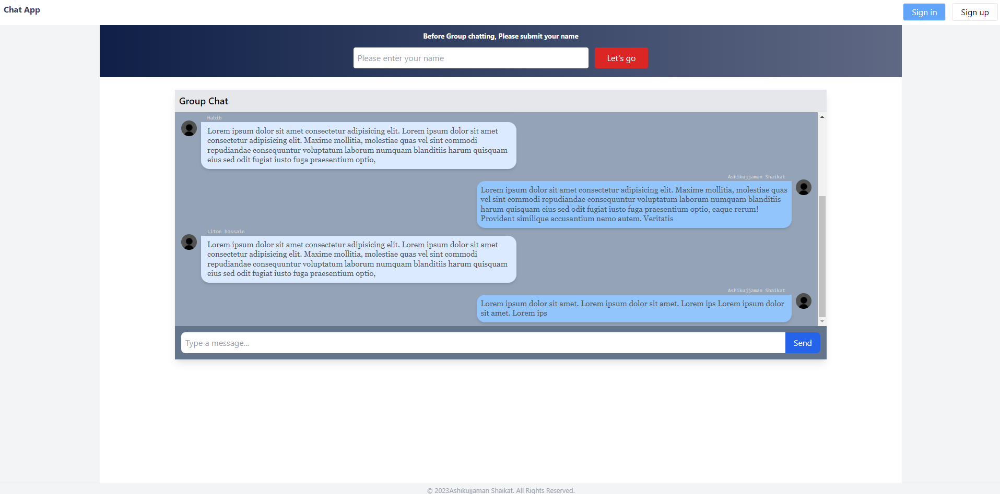

# Chat Application

### Local Environment Setup

#### Dependencies

- Nextjs 13   
- Tailwind 


### Installing the project

```
git checkout dev
```

## Installation all dependencies
```
npm install
```

### Run the application
```
npm run dev
```

